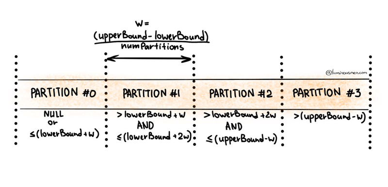

### **url**
###### _(none) (read/write)_
The JDBC URL of the form jdbc:subprotocol:subname to connect to. The source-specific connection properties may be specified in the URL. e.g., jdbc:postgresql://localhost/test?user=fred&password=secret	

-----------
### **dbtable**
###### _(none)_ _read/write_
The JDBC table that should be read from or written into. Note that when using it in the read path anything that is valid in a FROM clause of a SQL query can be used. For example, instead of a full table you could also use a subquery in parentheses. It is not allowed to specify dbtable and query options at the same time.

-----------
### **query**	
###### _(none)_ _read/write_ 
A query that will be used to read data into Spark. The specified query will be parenthesized and used as a subquery in the FROM clause. Spark will also assign an alias to the subquery clause. As an example, spark will issue a query of the following form to the JDBC Source. SELECT <columns> FROM (<user_specified_query>) spark_gen_alias
Below are a couple of restrictions while using this option. It is not allowed to specify dbtable and query options at the same time. It is not allowed to specify query and partitionColumn options at the same time. When specifying partitionColumn option is required, the subquery can be specified using dbtable option instead and partition columns can be qualified using the subquery alias provided as part of dbtable.
Example:
spark.read.format("jdbc")
.option("url", jdbcUrl)
.option("query", "select c1, c2 from t1")
.load()

------------------
### **driver**
###### _(none)(read/write)_ 
The class name of the JDBC driver to use to connect to this URL.

------------------
### **partitionColumn, lowerBound, upperBound**	
###### _(none) read_
These options must all be specified if any of them is specified. In addition, numPartitions must be specified. They describe how to partition the table when reading in parallel from multiple workers. partitionColumn must be a numeric, date, or timestamp column from the table in question. Notice that lowerBound and upperBound are just used to decide the partition stride, not for filtering the rows in table. So all rows in the table will be partitioned and returned. This option applies only to reading.

Все эти параметры должны быть указаны, если указан какой-либо из них. Кроме того, необходимо указать numPartitions. Они описывают, как разбить таблицу на разделы при параллельном чтении из нескольких рабочих. partitionColumn должен быть числовым столбцом, столбцом даты или метки времени из рассматриваемой таблицы. Обратите внимание, что нижняя и верхняя границы используются только для определения шага раздела, а не для фильтрации строк в таблице. Таким образом, все строки в таблице будут разделены и возвращены. Этот параметр применяется только к чтению.

--------------
### **numPartitions**
###### _(none) read/write_
The maximum number of partitions that can be used for parallelism in table reading and writing. This also determines the maximum number of concurrent JDBC connections. If the number of partitions to write exceeds this limit, we decrease it to this limit by calling coalesce(numPartitions) before writing.

Максимальное количество разделов, которые могут быть использованы для параллелизма при чтении и записи таблиц. Это также определяет максимальное количество одновременных подключений JDBC. Если количество записываемых разделов превышает этот предел, мы уменьшаем его до этого предела, вызывая coalesce(numPartitions) перед записью.

[Spark Tips. Optimizing JDBC data source reads](https://luminousmen.com/post/spark-tips-optimizing-jdbc-data-source-reads)
--------------
### **queryTimeout**
###### _0 read/write_
The number of seconds the driver will wait for a Statement object to execute to the given number of seconds. Zero means there is no limit. In the write path, this option depends on how JDBC drivers implement the API setQueryTimeout, e.g., the h2 JDBC driver checks the timeout of each query instead of an entire JDBC batch.

Количество секунд, в течение которых драйвер будет ожидать выполнения объекта Statement в течение заданного количества секунд. Ноль означает, что предела нет. В пути записи этот параметр зависит от того, как драйверы JDBC реализуют API setQueryTimeout, например, драйвер h2 JDBC проверяет время ожидания каждого запроса вместо всего пакета JDBC.

--------------
### **fetchsize**
###### _0 read_
The JDBC fetch size, which determines how many rows to fetch per round trip. This can help performance on JDBC drivers which default to low fetch size (e.g. Oracle with 10 rows).

Размер выборки JDBC, который определяет, сколько строк нужно извлекать за поездку туда и обратно. Это может повысить производительность драйверов JDBC, которые по умолчанию имеют низкий размер выборки (например, Oracle с 10 строками).

--------------
### **batchsize**
###### _1000 write_
The JDBC batch size, which determines how many rows to insert per round trip. This can help performance on JDBC drivers. This option applies only to writing.	

Размер пакета JDBC, который определяет, сколько строк нужно вставить за один цикл туда и обратно. Это может повысить производительность драйверов JDBC. Этот параметр применим только к письму.

--------------
### **isolationLevel**
###### _READ_UNCOMMITTED write_
The transaction isolation level, which applies to current connection. It can be one of NONE, READ_COMMITTED, READ_UNCOMMITTED, REPEATABLE_READ, or SERIALIZABLE, corresponding to standard transaction isolation levels defined by JDBC's Connection object, with default of READ_UNCOMMITTED. Please refer the documentation in java.sql.Connection.	

Уровень изоляции транзакции, который применяется к текущему соединению. Это может быть один из NONE, READ_COMMITTED, READ_UNCOMMITTED, REPEATABLE_READ или SERIALIZABLE, соответствующий стандартным уровням изоляции транзакций, определенным объектом подключения JDBC, с значением по умолчанию READ_UNCOMMITTED. Пожалуйста, обратитесь к документации в java.sql.Connection.

--------------
### **sessionInitStatement**
###### _(none) read_
After each database session is opened to the remote DB and before starting to read data, this option executes a custom SQL statement (or a PL/SQL block). Use this to implement session initialization code. 

Example: `option("sessionInitStatement", """BEGIN execute immediate 'alter session set "_serial_direct_read"=true'; END;""")	`

После открытия каждого сеанса базы данных для удаленной базы данных и перед началом чтения данных этот параметр выполняет пользовательскую инструкцию SQL (или блок PL/SQL). Используйте это для реализации кода инициализации сеанса. 

`Пример: option("sessionInitStatement", """BEGIN execute immediate 'alter session set "_serial_direct_read"=true'; END;""")
`
--------------
### **truncate**
###### _false write_
This is a JDBC writer related option. When SaveMode.Overwrite is enabled, this option causes Spark to truncate an existing table instead of dropping and recreating it. This can be more efficient, and prevents the table metadata (e.g., indices) from being removed. However, it will not work in some cases, such as when the new data has a different schema. In case of failures, users should turn off truncate option to use DROP TABLE again. Also, due to the different behavior of TRUNCATE TABLE among DBMS, it's not always safe to use this. MySQLDialect, DB2Dialect, MsSqlServerDialect, DerbyDialect, and OracleDialect supports this while PostgresDialect and default JDBCDirect doesn't. For unknown and unsupported JDBCDirect, the user option truncate is ignored.	

Это опция, связанная с JDBC writer. Когда SaveMode.Overwrite = true приводит к тому, что Spark усекает существующую таблицу вместо удаления и воссоздания ее заново. Это может быть более эффективным и предотвращает удаление метаданных таблицы (например, индексов). Однако в некоторых случаях это не сработает, например, когда новые данные имеют другую схему. В случае сбоев пользователи должны отключить опцию усечения, чтобы снова использовать таблицу удаления. Кроме того, из-за различного поведения УСЕЧЕННОЙ ТАБЛИЦЫ в разных СУБД это не всегда безопасно использовать. MySQLDialect, DB2Dialect, MsSqlServerDialect, DerbyDialect и OracleDialect поддерживают это, в то время как PostgresDialect и default JDBCDirect этого не делают. Для неизвестного и неподдерживаемого JDBCDirect пользовательский параметр truncate игнорируется.

--------------
### **cascadeTruncate**
###### _(write)_
###### _(the default cascading truncate behaviour of the JDBC database in question, specified in the isCascadeTruncate in each JDBCDialect)_	

Это опция, связанная с JDBC writer. Если этот параметр включен и поддерживается базой данных JDBC (на данный момент PostgreSQL и Oracle), он позволяет выполнять КАСКАД УСЕЧЕНИЯ ТАБЛИЦЫ t (в случае PostgreSQL выполняется только КАСКАД УСЕЧЕНИЯ ТАБЛИЦЫ t, чтобы предотвратить непреднамеренное усечение таблиц-потомков). Это повлияет на другие таблицы, и поэтому их следует использовать с осторожностью.	

Это опция, связанная с JDBC writer. Если указано, этот параметр позволяет задавать параметры таблицы и раздела, относящиеся к конкретной базе данных, при создании таблицы.

--------------
### **createTableOptions**	
###### _write_

This is a JDBC writer related option. If specified, this option allows setting of database-specific table and partition options when creating a table (e.g., CREATE TABLE t (name string) ENGINE=InnoDB.).

Это опция, связанная с JDBC writer. Если указано, этот параметр позволяет задавать параметры таблицы и раздела, относящиеся к конкретной базе данных, при создании таблицы

--------------
### **createTableColumnTypes**
###### _(none)	 write_

The database column data types to use instead of the defaults, when creating the table. Data type information should be specified in the same format as CREATE TABLE columns syntax (e.g: "name CHAR(64), comments VARCHAR(1024)"). The specified types should be valid spark sql data types.

Типы данных столбцов базы данных, которые будут использоваться вместо значений по умолчанию при создании таблицы. Информация о типе данных должна быть указана в том же формате, что и синтаксис СОЗДАНИЯ столбцов ТАБЛИЦЫ (например: "name CHAR(64), comments VARCHAR(1024)"). Указанные типы должны быть допустимыми типами данных spark sql.

--------------
### **customSchema**
###### _(none)	 read_

The custom schema to use for reading data from JDBC connectors. For example, "id DECIMAL(38, 0), name STRING". You can also specify partial fields, and the others use the default type mapping. For example, "id DECIMAL(38, 0)". The column names should be identical to the corresponding column names of JDBC table. Users can specify the corresponding data types of Spark SQL instead of using the defaults.	

--------------
### **pushDownPredicate**
###### _(true)(read)_
The option to enable or disable predicate push-down into the JDBC data source. The default value is true, in which case Spark will push down filters to the JDBC data source as much as possible. Otherwise, if set to false, no filter will be pushed down to the JDBC data source and thus all filters will be handled by Spark. Predicate push-down is usually turned off when the predicate filtering is performed faster by Spark than by the JDBC data source.

Пользовательская схема, используемая для чтения данных из соединителей JDBC. Например, "идентификатор ДЕСЯТИЧНЫЙ(38, 0), СТРОКА имени". Вы также можете указать частичные поля, а остальные используют сопоставление типов по умолчанию. Например, "идентификатор ДЕСЯТИЧНЫЙ(38, 0)". Имена столбцов должны быть идентичны соответствующим именам столбцов таблицы JDBC. Пользователи могут указывать соответствующие типы данных Spark SQL вместо использования значений по умолчанию.

--------------
### **pushDownAggregate**
###### _false	 read_
The option to enable or disable aggregate push-down in V2 JDBC data source. The default value is false, in which case Spark will not push down aggregates to the JDBC data source. Otherwise, if sets to true, aggregates will be pushed down to the JDBC data source. Aggregate push-down is usually turned off when the aggregate is performed faster by Spark than by the JDBC data source. Please note that aggregates can be pushed down if and only if all the aggregate functions and the related filters can be pushed down. If numPartitions equals to 1 or the group by key is the same as partitionColumn, Spark will push down aggregate to data source completely and not apply a final aggregate over the data source output. Otherwise, Spark will apply a final aggregate over the data source output.	

Возможность включить или отключить aggregate push-down в источнике данных JDBC версии V2. Значение по умолчанию равно false, и в этом случае Spark не будет передавать агрегированные данные в источник данных JDBC. В противном случае, если установлено значение true, агрегаты будут перенесены в источник данных JDBC. Агрегатное нажатие обычно отключается, когда агрегат выполняется Spark быстрее, чем источником данных JDBC. Пожалуйста, обратите внимание, что агрегаты могут быть отключены тогда и только тогда, когда все агрегатные функции и связанные с ними фильтры могут быть отключены. Если numPartitions равно 1 или group by key совпадает с partitionColumn, Spark полностью перенесет агрегат в источник данных и не применит окончательный агрегат к выходным данным источника данных. В противном случае Spark применит окончательный агрегат к выходным данным источника данных.

--------------
### **pushDownLimit**
###### _false	 read_
The option to enable or disable LIMIT push-down into V2 JDBC data source. The LIMIT push-down also includes LIMIT + SORT , a.k.a. the Top N operator. The default value is false, in which case Spark does not push down LIMIT or LIMIT with SORT to the JDBC data source. Otherwise, if sets to true, LIMIT or LIMIT with SORT is pushed down to the JDBC data source. If numPartitions is greater than 1, SPARK still applies LIMIT or LIMIT with SORT on the result from data source even if LIMIT or LIMIT with SORT is pushed down. Otherwise, if LIMIT or LIMIT with SORT is pushed down and numPartitions equals to 1, SPARK will not apply LIMIT or LIMIT with SORT on the result from data source.	

Возможность включить или отключить ограничение push-down в источнике данных JDBC версии V2. Кнопка LIMIT push-down также включает в себя LIMIT + SORT , также известную как оператор Top N. Значение по умолчанию равно false, и в этом случае Spark не нажимает LIMIT или LIMIT with SORT на источник данных JDBC. В противном случае, если установлено значение true, LIMIT или ОГРАНИЧЕНИЕ с СОРТИРОВКОЙ переносится в источник данных JDBC. Если numPartitions больше 1, SPARK по-прежнему применяет LIMIT или LIMIT with SORT к результату из источника данных, даже если значение LIMIT или LIMIT with SORT понижено. В противном случае, если значение LIMIT или LIMIT with SORT опущено, а numPartitions равно 1, SPARK не будет применять LIMIT или LIMIT with SORT к результату из источника данных.

--------------
### **pushDownTableSample**
###### _false	 read_
The option to enable or disable TABLESAMPLE push-down into V2 JDBC data source. The default value is false, in which case Spark does not push down TABLESAMPLE to the JDBC data source. Otherwise, if value sets to true, TABLESAMPLE is pushed down to the JDBC data source.	

Опция для включения или отключения TABLESAMPLE push-down в источник данных JDBC версии V2. Значение по умолчанию равно false, и в этом случае Spark не отправляет TABLESAMPLE в источник данных JDBC. В противном случае, если значение равно true, TABLESAMPLE будет перенесен в источник данных JDBC.

--------------
### **keytab**
###### _(none)(read/write)_
Location of the kerberos keytab file (which must be pre-uploaded to all nodes either by --files option of spark-submit or manually) for the JDBC client. When path information found then Spark considers the keytab distributed manually, otherwise --files assumed. If both keytab and principal are defined then Spark tries to do kerberos authentication.

Расположение файла keytab kerberos (который должен быть предварительно загружен на все узлы либо с помощью опции --files в spark-submit, либо вручную) для клиента JDBC. Когда информация о пути найдена, Spark считает, что keytab распространяется вручную, в противном случае - предполагается, что файлы. Если определены как keytab, так и principal, то Spark пытается выполнить проверку подлинности kerberos.

--------------
### **principal**
###### _(none)(read/write)_
Specifies kerberos principal name for the JDBC client. If both keytab and principal are defined then Spark tries to do kerberos authentication.

Задает имя участника kerberos для клиента JDBC. Если определены как keytab, так и principal, то Spark пытается выполнить проверку подлинности kerberos.

--------------
### **refreshKrb5Config**
###### _false read/write_
This option controls whether the kerberos configuration is to be refreshed or not for the JDBC client before establishing a new connection. Set to true if you want to refresh the configuration, otherwise set to false. The default value is false. Note that if you set this option to true and try to establish multiple connections, a race condition can occur. One possble situation would be like as follows.
refreshKrb5Config flag is set with security context 1
A JDBC connection provider is used for the corresponding DBMS
The krb5.conf is modified but the JVM not yet realized that it must be reloaded
Spark authenticates successfully for security context 1
The JVM loads security context 2 from the modified krb5.conf
Spark restores the previously saved security context 1
The modified krb5.conf content just gone

Этот параметр определяет, следует ли обновлять конфигурацию kerberos для клиента JDBC или нет перед установлением нового соединения. Установите значение true, если вы хотите обновить конфигурацию, в противном случае установите значение false. Значение по умолчанию равно false. Обратите внимание, что если вы установите для этого параметра значение true и попытаетесь установить несколько подключений, может возникнуть состояние гонки. Одна из возможных ситуаций была бы следующей.
Флаг refreshKrb5Config установлен с контекстом безопасности 1
Поставщик подключения JDBC используется для соответствующей СУБД
krb5.conf изменен, но JVM еще не поняла, что его необходимо перезагрузить
Spark успешно проходит проверку подлинности в контексте безопасности 1
JVM загружает контекст безопасности 2 из измененного krb5.conf
Spark восстанавливает ранее сохраненный контекст безопасности 1
Измененное содержимое krb5.conf просто исчезло

--------------
### **connectionProvider**
###### _(none)	 read/write_
The name of the JDBC connection provider to use to connect to this URL, e.g. db2, mssql. Must be one of the providers loaded with the JDBC data source. Used to disambiguate when more than one provider can handle the specified driver and options. The selected provider must not be disabled by spark.sql.sources.disabledJdbcConnProviderList.	

Имя поставщика подключения JDBC, который будет использоваться для подключения к этому URL, например db2, mssql. Должен быть одним из поставщиков, загруженных с источником данных JDBC. Используется для устранения неоднозначности, когда более чем один поставщик может обрабатывать указанный драйвер и параметры. Выбранный поставщик не должен быть отключен spark.sql.sources.disabledJdbcConnProviderList.
